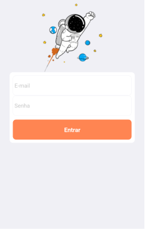
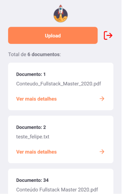
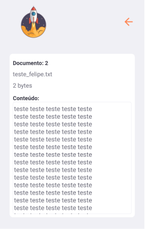

  
  

# Projeto

<strong>File App - Mobile App</strong>

Esse projeto tem por objetivo permitir fazer upload e armazenar arquivos em um App. O sistema também permite a leitura dos arquivos. 
A API Node.js possui um mecanismo de autenticação para identificar o usuário que está fazendo as requisições.

 

  
  

  
  

# Tecnologias

Foram utilizadas as seguintes tecnologias:

- [Node.js](https://nodejs.org/en)
- [React Native](https://reactnative.dev)
- [Expo](https://expo.io)

# Vídeos

- [Gestão de Documentos - Mobile App (Backend)](https://youtu.be/sy7hsQrhXIg)
- [Gestão de Documentos - Mobile App (Frontend)](https://youtu.be/MjYjFk6YivM)
- [Gestão de Documentos - Mobile App (Demo)](https://youtu.be/APLWpZrri2E)
